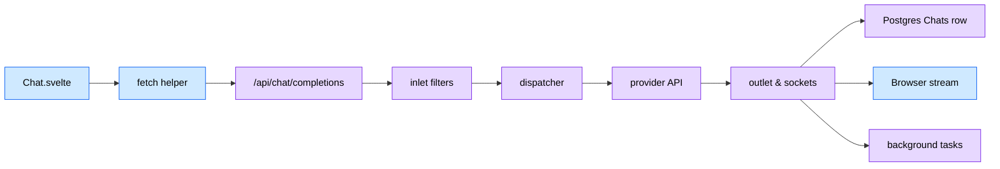
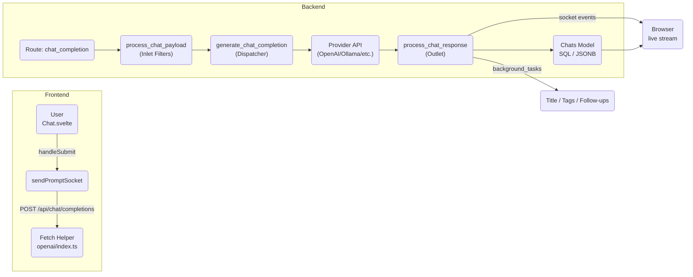

# Message Execution Path

**Completed and reviewed:** 2025-06-10
**Open WebUI Version**: v0.6.14

This document explains how a chat message travels from the user interface in `Chat.svelte` through the backend until it is stored in the database. Line numbers refer to the upstream snapshot in `external/open-webui`.

## 1 · The Story in 90 Seconds
1. **A user types “Hi!” and clicks Send.**
2. The browser immediately inserts this new message into its local chat history, making the UI feel responsive and instantaneous.
3. A `POST /api/chat/completions` request leaves the browser, carrying:
   * the complete chat history,
   * the selected AI model,
   * any attached files,
   * and special feature flags (e.g., whether the reply should be streamed).
4. On arrival, the backend’s **inlet pipeline** enriches the payload by:
   * injecting relevant memory (past context),
   * resolving requested tools (e.g., web searches or calculations),
   * bundling and attaching file references,
   * and stamping useful metadata (like session and message IDs) onto the request context.
5. A **dispatcher** examines this enriched payload and decides exactly *where* to send it next:
   * an external API (e.g., OpenAI),
   * a local model (like Ollama),
   * an "arena" aggregator (which dynamically selects among multiple sub-models),
   * or a custom Python pipeline handler.
6. The chosen provider generates a response, typically by streaming back incremental chunks. The backend immediately forwards these chunks over a WebSocket to the browser, and optionally persists them incrementally in the database (Postgres).
7. When the streaming concludes, the backend kicks off background tasks to auto-generate:
   * a meaningful chat title,
   * descriptive tags,
   * and suggested follow-up questions.
   
   These enhancements appear in the UI moments later.
8. Finally, the completed assistant response is definitively saved (upserted) into the database's `chat` row.

---

## 2 · Visual Map  





Great. I’ll restructure and rewrite the current Open WebUI message lifecycle documentation to make it easy for new frontend and backend developers to grasp the complete flow—from user input to backend processing and storage. I’ll enhance visual clarity with annotated diagrams, provide layered explanations for both high-level and deep-dive readers, and include a new section with debugging tips, common pitfalls, and extensibility guidance.

I’ll get started and let you know once it’s ready for your review.


# Chat Message Lifecycle in Open WebUI

**Overview:** When a user sends a message in the Open WebUI chat interface, it travels through a multi-stage pipeline from the **frontend** Svelte UI to the **backend** server and ultimately into persistent storage. Along the way, various components handle the message (adding metadata, invoking AI models, streaming results, updating the UI, etc.). The high-level flow is:

1. **Frontend – User Prompt Submission:** The user’s message is captured in the chat UI and a corresponding message object (with IDs, role, content, etc.) is created and added to the in-browser chat history.
2. **Frontend – API Request Dispatch:** The frontend compiles the conversation history and user inputs (including any attached files or tool selections) into an OpenAI-compatible request. It then issues a POST request to the backend API (`/api/chat/completions`) for each selected AI model.
3. **Backend – Request Inlet & Payload Processing:** The backend receives the request and normalizes it. It enriches the payload with metadata (IDs, user info, features flags, etc.), runs it through any enabled **filters or plugins**, handles tools or web searches, and prepares the final prompt for the model.
4. **Backend – Model Selection & Invocation:** Based on the target model, the system routes the request to the appropriate AI **provider** or internal pipeline. This could be an OpenAI API call, a local model (e.g. Ollama), a custom function pipeline, or an aggregator that picks a sub-model. The model generates a completion (streaming or full reply).
5. **Backend – Response Handling (Streaming/Non-Streaming):** As the model’s response comes in, the backend sends incremental updates back to the frontend (for streaming) or a final response. It emits WebSocket events to update the UI in real-time, and records usage or error information. Once the response is done, any post-processing tasks (like generating follow-up questions or updating chat titles) are triggered.
6. **Database – Saving the Chat:** The completed assistant message (and any partial content if applicable) is saved into the chat history in the database. The chat’s metadata (current message ID, title, tags, etc.) is updated. Background tasks may add extra metadata (like suggested tags or follow-up prompts) and trigger additional events to the UI.

## 1. Frontend – User Submits a Prompt

**Component:** *Chat.svelte* (Svelte frontend)

* **Create message object:** When the user clicks **Send**, the chat UI generates a new *user message* object in memory. This occurs in the `Chat.svelte` component. The code assigns a unique `id` to the message, links it to the current conversation thread via `parentId` (and prepares a placeholder for the assistant reply as a child), sets the `role` to `"user"`, and stores the text `content` the user entered. It also captures a timestamp and includes any attached `files` in the message object. This new user message represents the prompt the user is sending.
* **Update local history:** The user message is immediately inserted into the local chat `history`. The frontend adds the message to the in-memory `history.messages` map and updates `history.currentId` to this new message’s ID. This marks the user message as the latest in the conversation thread. The UI also creates a corresponding *placeholder assistant message* (with a new ID, role `"assistant"`, and empty content) as the expected response for each selected model. These placeholder entries are added to the history so the UI can immediately show that the assistant is “thinking.”
* **UI feedback:** After updating the history, the frontend may scroll the chat view to show the new messages. If this is the first message in a new chat, an initialization routine runs to set up a new chat session.

## 2. Frontend – Preparing and Sending the API Request

**Component:** *sendPromptSocket* function (inside `Chat.svelte`)

* **Compile chat payload:** Next, the frontend gathers all relevant data to send to the backend. It collects the recent conversation messages (converting the internal `history.messages` structure into an array of `{role, content, ...}` objects) and packages them into the OpenAI API format under a `messages` list. It also includes any other required fields: the target `model` ID, whether streaming is requested, and parameters/settings like temperature or max tokens. If files are attached, it merges those into the payload (e.g. embedding file metadata or content references). Feature flags for tools, web search, code interpreter, etc., are added as a `features` object. By the time this payload is ready, it closely mirrors an OpenAI ChatCompletion request body.
* **Dispatch HTTP request:** The frontend then calls a helper (e.g. `generateOpenAIChatCompletion()` in the Open WebUI API module) to send the HTTP POST request to the backend endpoint `/api/chat/completions`. This request contains a JSON body with the compiled chat payload. (Under the hood, this uses `fetch` to call the FastAPI backend.) Each selected model triggers its own request – for example, if multiple models are chosen, the code loops through them and sends one payload per model, associating each request with its corresponding placeholder response message.
* **Error handling on frontend:** If the network request fails or the backend returns an error, the frontend catches it. The `handleOpenAIError` routine will mark the placeholder assistant message with an `error` field and `done=true`, allowing the UI to display the error text. (The error details are sent back in the response body by the backend on failure, as described later.) The UI may also show a toast notification for the error. In any case, this ensures the user is informed of issues (e.g. unauthorized, model not found, etc.) and the chat history isn’t left hanging.

## 3. Backend – Request Inlet & Payload Processing

**Component:** *FastAPI route handler* (`POST /api/chat/completions` -> `chat_completion` in `main.py`)

* **Authentication and setup:** When the HTTP request arrives at the backend, it is handled by the `chat_completion` route function. The user’s session/token is verified (`get_verified_user` dependency) to ensure the request is authorized. The handler begins by extracting fields from the incoming JSON: e.g. `chat_id` (the conversation ID), `id` (the assistant placeholder message ID), `session_id` (WebSocket session for events), and so on. It packages these into a `metadata` dict for this request. This metadata will travel alongside the message for logging, events, and database keys.

* **Stash metadata and call middleware:** The `metadata` dict is attached to the request state (`request.state.metadata`) and also injected into the payload itself (`form_data["metadata"]`). The backend then invokes the core middleware function `process_chat_payload` to handle all the preprocessing logic. This function (defined in `utils/middleware.py`) takes the raw `form_data` and the metadata and returns a possibly mutated form\_data, updated metadata, and a list of event objects. Its responsibilities include:

  * **Apply model params:** Merge any model-specific default parameters into the request. For example, certain models might have default temperature, system prompts, etc. The code uses `apply_params_to_form_data` to overlay model defaults onto the incoming `form_data`.
  * **Initialize event callbacks:** Set up an `event_emitter` and `event_call` for this request. These are callbacks that will emit WebSocket events (`event_emitter`) or trigger internal function calls (`event_call`) during processing. They are stored in an `extra_params` dict along with user info and references to the request, model, and metadata for use by later pipeline steps.
  * **Run inlet filters:** Pass the payload through any **pipeline inlet filters**. These are optional custom transformations that can modify the prompt or take action before the model is called. The framework uses `process_pipeline_inlet_filter` to apply such filters (if any are configured) to the `form_data`. It also handles any **filter functions** (custom code injections) marked for the inlet stage. If a filter raises an exception, the request is aborted with an error.
  * **Feature handlers:** Inject system-generated content for special features. If the payload’s `features` dict requests **memory**, **web\_search**, **image\_generation**, or **code\_interpreter**, the middleware will call the corresponding handler:

    * Memory: `chat_memory_handler` (to retrieve long-term memory and augment the prompt).
    * Web search: `chat_web_search_handler` (to perform a web search and append the results).
    * Image generation: `chat_image_generation_handler` (to insert an image generation request stub).
    * Code interpreter: A special system message is added instructing the assistant to respond in JSON (for code execution).
      Each enabled feature may add new messages to the prompt or adjust parameters. After handling, the feature flags are removed from `form_data`.
  * **Tool resolution:** If the user provided any tool IDs (for function calling) in the request or if the assistant is expected to use tools:

    * The IDs of requested tools are taken from the payload, and the backend looks up each tool’s specification (its name, parameters, and how to execute it) via `get_tools`.
    * If *native* function calling is supported by the model (indicated by `metadata["function_calling"] == "native"`), the tool specs are inserted into the request under `form_data["tools"]` as function definitions. This means the model itself will decide if and how to call those functions (as with OpenAI function calling).
    * If the model does **not** support native function calling, the middleware will handle tools **server-side**. It calls `chat_completion_tools_handler` to decide which tool to call and executes it (this may generate interim events and results). The tool’s output (for example, a retrieved document or calculation result) is then appended to the conversation as context, and any file outputs are noted. This way, even models without native tooling can still use the provided tools via the middleware.
  * **File attachments and citations:** The middleware next processes any `files` in the request via `chat_completion_files_handler`. This step may fetch file contents (if they are references to external data) and incorporate them into the prompt, or prepare them for the model’s context. For example, if the user has uploaded a document or if a tool returned some text to cite, this handler bundles those into the prompt and tracks citation metadata. Any source citations or context strings extracted from files are collected into an `events` list.
  * **Finalize payload:** At this point, the `form_data` contains the fully prepared `messages` array (with any system or assistant injections from tools/search), a list of tool specs if needed, and all flags set for model invocation. The `metadata` now includes things like `tool_ids`, `files` (a de-duplicated list of file info), and possibly a flag indicating native function calling. The `events` list contains any pre-generated events that should be sent to the client (such as citation info or status messages).
  * **Return to route:** `process_chat_payload` returns the trio `(form_data, metadata, events)` back to the `chat_completion` route. At this point, the input is fully prepared for the model. (If any error occurred in the steps above, an exception would be raised and caught here – the backend would update the message in the DB with an error and return an HTTP 400 to the client, as described later in error handling.)

* **Choosing the model backend:** With a cleaned and enriched payload in hand, the backend now dispatches the request to the model. It calls `generate_chat_completion` (in `utils/chat.py`) to handle this. This function examines the `model` specified in the request and decides which backend or API should process it:

  * **Direct socket connection:** If the request came from another WebUI instance (an uncommon case indicated by `request.state.direct`), it uses `generate_direct_chat_completion` to forward the request over a socket to that instance. (This is mainly for orchestrating with external services and not typical for user-driven chats.)
  * **Aggregator (“arena”) model:** If the selected model is a meta-model that represents an *arena* (a pool of models), the system will randomly pick one of the underlying models. The code checks `model["owned_by"] == "arena"` and chooses a sub-model from its list. It then **replaces** `form_data["model"]` with the chosen model’s ID and calls `generate_chat_completion` again recursively to actually get a completion from that model (with `bypass_filter=True` to skip repeating checks). In streaming mode, it will first send a small event to the client indicating which model was selected (so the UI knows which model responded). In non-stream mode, it will attach the chosen model’s ID to the final result payload. This arena feature allows load-balancing or ensemble behavior across multiple models.
  * **Custom pipeline (“pipe”) model:** If the model is configured with a custom pipeline function (`model.get("pipe")` is truthy), the request is routed to `generate_function_chat_completion`. This mechanism allows extension of the system with custom Python functions or plugins that act as models – for example, a special model that formats answers or routes queries differently. The function will execute and return an assistant response just like an AI model would.
  * **Ollama (local LLM) model:** If the model is served by an **Ollama** backend (`owned_by == "ollama"`), the payload is converted from OpenAI format to Ollama’s format, and `generate_ollama_chat_completion` is called to get a response from the local model. If streaming, the incoming Ollama stream is converted on-the-fly into OpenAI-style chunks and forwarded to the client. If non-stream, the full Ollama response is converted into the standard OpenAI completion format. This allows Open WebUI to use local models with the same interface as OpenAI models.
  * **Default OpenAI/API model:** For all other cases, the system assumes it’s an OpenAI-compatible model (including open-source models served via the OpenAI API format). It calls `generate_openai_chat_completion` which handles making the actual API call to OpenAI or another provider. This function is also used for Azure OpenAI or other compatible endpoints. The request payload (`form_data`) at this point contains everything needed: the `model` name or ID, the messages, any tools (for native function calling), etc., so it can be sent to the provider. The result (stream or not) will be an OpenAI-format response.

At the end of this stage, the backend has forwarded the prompt to the chosen model backend and is waiting for a response. The flow now depends on whether the response will be **streamed** or returned all at once.

## 4. Backend – Response Handling and Streaming

**Component:** *process\_chat\_response* (in `middleware.py` – the “outlet” of the pipeline)

When the model’s completion comes back, control passes to `process_chat_response`. This function is responsible for sending the result to the client (via events or HTTP response), saving it to the database, and triggering any follow-up actions. It handles streaming responses differently from non-streaming:

#### Non-Streaming Responses (full reply available immediately)

If the model returned a complete response (not chunked), `process_chat_response` proceeds synchronously:

* **Update DB for model or errors:** The code first logs any special fields. If the model’s response contains an `"error"` (for example, the API returned a validation error or the model isn’t found), the backend writes that error into the message record in the database. It uses `Chats.upsert_message_to_chat_by_id_and_message_id` to store the error text under `error.content` for that message. Similarly, if the response payload indicates a `selected_model_id` (from an arena model picking a submodel), it updates the message in the DB to record which model actually responded. These updates ensure the persistent chat history knows about errors or model selections.
* **Emit completion event:** Assuming we have a successful completion, the backend next sends it out to any listening frontends via WebSocket. It uses the `event_emitter` set up earlier to broadcast a `chat:completion` event containing the raw response JSON. This event immediately delivers the assistant’s answer to the UI (so the user can see the assistant’s message appear). Even in non-streaming mode, Open WebUI uses events to update the frontend in real-time.
* **Emit “done” event:** After the initial content, the backend emits another `chat:completion` event with a `{ done: true }` flag and some metadata. This signals to the UI that the assistant’s answer is fully complete. Along with the `done: true`, it may include a `title` field (the auto-generated chat title) and echoes the final `content` for convenience. The UI uses this to know no more data is coming for that message.
* **Persist the assistant message:** The full content of the assistant’s reply is then saved to the database. The placeholder message (which was created in the DB when the user prompt was received) is updated with `role: "assistant"` and the `content` filled in. From this point on, the conversation history in the DB has the complete assistant message.
* **Post-completion hooks:** The system triggers any additional actions now that the message is stored:

  * A **webhook notification** may be sent if the user is not actively online. The code checks if the user is inactive and has a webhook URL registered; if so, it sends an HTTP POST with the chat title and message content to that URL (allowing external systems to get a notification).
  * **Background tasks** are started (in the same request thread) to generate things like follow-up questions, update the chat title (if it was untitled), and generate tags. These run via a helper `background_tasks_handler` (see [Section 6](#6-database-persistence--post-processing) below for details on what they do). In the non-stream case, the backend awaits the background tasks to finish before completing the request.
* **Final API response:** Finally, the HTTP response is returned to the original requester. Before returning, the backend merges any extra events from the `events` list (collected during payload processing) into the response JSON. For example, if citations or tool usage info were prepared, they get added to the response under additional keys. The final response is then sent back to the frontend’s `fetch` call. In practice, the frontend might not even need this response since the UI is already updated via websockets, but it can be useful for debugging or for API clients calling this endpoint directly.

In summary, for non-streaming requests the frontend will have received the assistant’s full answer (and any error or model-selection info) via socket events by the time the HTTP call returns. The database is updated with the new message and any side effects are launched.

#### Streaming Responses (incremental chunking)

If the model supports streaming, the backend uses a more complex asynchronous flow to stream tokens to the client. In this case, `process_chat_response` does **not** directly send the chunks on the HTTP response (to avoid tying up the FastAPI thread). Instead, it spins off a background task that will handle the token stream, and it immediately returns a quick acknowledgment to the frontend. The frontend then relies on WebSocket events to receive the streaming content. The process is as follows:

* **Spawn streaming task:** The backend generates a unique `task_id` and starts an async task (`asyncio.create_task`) to handle the streaming in the background. This allows the HTTP request to be answered without waiting for the entire stream. The HTTP response to the frontend is just `{ "status": true, "task_id": <id> }` to indicate that streaming has started.
* **Record initial info:** Before it spawns the task, the backend performs a couple of quick updates:

  * It updates the placeholder message in the database with the chosen model’s ID (in case it wasn’t already known). For example, if an aggregator deferred model selection until now, it writes the actual `model` field to the DB so it’s recorded early.
  * It may emit any pending events from the preprocessing stage. For instance, if the `events` list contained items (like a citation context that was prepared or a “search in progress” status), those events are immediately emitted to the client *before* streaming starts. This gives the UI immediate feedback (such as “Using tool X…” messages or reference snippets) even as the model is just beginning to respond.
* **Streaming loop:** The background task (`post_response_handler`) now takes over. It reads chunks from the model’s streaming response one by one. For each token or message chunk:

  * It may perform filtering or assembly. The OpenAI stream returns chunks containing pieces of the message content. The code assembles these into a coherent message. It also keeps track of special cases like code blocks (to ensure the UI knows when a code block is opening or closing) and whitespace handling. The goal is to maintain formatting (especially for Markdown/code) correctly in real-time.
  * The assembled partial content is then sent to the frontend via the `event_emitter`. Each chunk is broadcast as a `chat:completion` event containing the current partial `content`. The frontend concatenates these to build the message progressively in the UI. (Chunks might be sent as soon as a newline or sentence is formed, depending on implementation.)
  * **Real-time DB save:** If the system is configured with `ENABLE_REALTIME_CHAT_SAVE`, the backend will also update the database continuously with the content as it streams in. This means each new chunk is appended to the assistant message record so that if the process is interrupted, the DB has whatever was generated so far. (In the code, this is done by calling `Chats.upsert_message_to_chat_by_id_and_message_id` repeatedly during streaming. For performance, it might throttle these updates to, say, one per second or at the end of a paragraph rather than every token.) If real-time save is disabled, the DB still only has the placeholder until the end.
  * If the model output includes function-call tool executions or other multi-part outputs, the streaming handler manages those as well – e.g. inserting `<details>` blocks in the content for each tool call and marking them as running or done. These show up in the UI as special expandable sections.
* **Stream completion:** When the model signals the end of the stream, the background task finalizes the message:

  * It obtains the final compiled content (all chunks combined). It then emits one last `chat:completion` event with the `{ done: true, content: <full content>, title: <chat title> }` payload. This tells the frontend that the streaming is complete and provides the final content and updated title. The UI will mark the assistant message as done at this point.
  * It updates the database with the full content (if not already fully saved in real-time). The code ensures the `history.messages[...]` for this assistant message now contains the entire answer text. It also sets the chat’s `currentId` to this message’s ID (already done when first chunk arrived, typically).
  * Like in the non-stream case, it triggers a webhook to notify an offline user (if applicable) with the final message.
  * Background tasks for title, follow-ups, tags are scheduled. In the streaming case, these are often started after the stream finishes (the code calls `background_tasks_handler` at the end of the stream task).
  * The streaming task then exits.
* **Client-side handling:** The frontend receives the `chat:completion` events as the stream progresses and updates the UI message content in real time. When the done event arrives, it knows the message is complete and stops any loading spinners.
* **Cancellation:** If the user disconnects or cancels the request mid-stream, the async task will get cancelled (raising `CancelledError`). The backend catches this, emits a `task-cancelled` event (so the UI can alert the user), and if needed, saves whatever content was generated up to that point to the database. This way, a partial answer isn’t lost if the user navigated away or closed the browser.

By using an asynchronous task and WebSocket events, Open WebUI’s backend can stream responses without keeping the HTTP connection open for Server-Sent Events (SSE). The UI benefits from the existing WebSocket channel (used for all chat updates) to get the data. This design also makes it easier to handle multiple concurrent streams and to ensure the database is eventually consistent with what was sent to the user.

## 5. Database Persistence & Post-Processing

**Component:** *Chats* model (`backend/open_webui/models/chats.py`)

Open WebUI stores chats in a database (e.g., SQLite or Postgres) in a table named **`chat`**. Each row of this table represents a conversation and contains a JSON field that holds the entire history of messages. Key columns of the `chat` table include the chat `id` (primary key), `user_id` (owner), `title`, the JSON `chat` field (which contains message history and other metadata), and timestamps.

The JSON structure (`chat` column) looks roughly like:

```python
{
  "history": {
    "messages": {
       "<messageId>": { ...message fields... },
       "<anotherMessageId>": { ... }
    },
    "currentId": "<latestMessageId>"
  },
  "created": <timestamp>,
  "updated": <timestamp>,
  ...other metadata...
}
```

Each message is stored by its ID under `history.messages`. The `currentId` points to the most recent message in the conversation (useful for threading).

When `process_chat_response` needs to save or update a message, it uses methods on the `Chats` model. The primary method is `Chats.upsert_message_to_chat_by_id_and_message_id(chat_id, message_id, message_dict)`. This loads the chat row, updates the specified message (or inserts it if not already present), updates the `currentId`, and writes the row back to the DB. Specifically:

* If a message with that ID already exists in the JSON, it merges the new fields into it. (For example, adding `"content"` once the AI’s content is ready, or adding an `"error"` field.)
* If the message ID did not exist (e.g., for a brand new message), it inserts the entire message object.
* It then sets `history.currentId = message_id`, marking this as the latest message.
* Finally, it calls `update_chat_by_id` to save the modified JSON back to the database.

**Fields in a message:** Each message JSON includes:

* **id**: unique UUID of the message.
* **parentId**: the ID of the message this is replying to (or `null` for root-level messages).
* **childrenIds**: list of IDs of replies to this message (for tracking threads).
* **role**: `"user"` or `"assistant"` (or `"system"` for system prompts).
* **content**: the text content of the message. (For the assistant, this starts as a placeholder like `"[RESPONSE] <uuid>"` and then is replaced with the real content.)
* **files** (optional): any file objects attached or generated for this message (e.g., uploads or tool outputs).
* **model** (for assistant): the ID of the model that produced this answer.
* **selectedModelId** (for assistant, optional): if an aggregator chose a model, this records which one.
* **error** (optional): an error payload if the message failed (including at least an error `content`).
* **timestamp**: Unix timestamp when the message was created.
* **followUps** (optional, added later): any suggested follow-up questions (generated by the system after an assistant reply).
* **statusHistory** (optional): a log of status events for this message (used for tracking in-progress actions like tool usage).

After an assistant response is fully stored, background tasks may add fields like `followUps` or update the `title` of the chat. For example, a follow-up question generator might attach a `followUps: [...]` list to the assistant’s message, and the UI would display those as suggestion chips.

**Chat title and tags:** The first user message in a chat often doesn’t have a title. Open WebUI generates a title automatically (using `generate_title`) after the first AI answer, using that answer’s content to summarize the topic. This happens in the background tasks:

* If a title is generated, `Chats.update_chat_title_by_id(chat_id, title)` is called to save it, and a `chat:title` event is emitted to update the UI in real-time.
* Similarly, if tag generation is enabled, `generate_chat_tags` will produce a list of tags for the conversation. These are saved with `Chats.update_chat_tags_by_id(chat_id, tags)`, and a `chat:tags` event broadcasts them to the UI.

Each write to the database (message or title or tags) updates the `updated_at` timestamp of the chat row. The design is such that even if the app crashes mid-response, the last known state (e.g., partial content if real-time saving on, or at least the user message and placeholder) is safely stored.

No explicit DB transaction management is shown around these updates – the code assumes each `upsert` or `update` either succeeds or fails independently. If a DB write fails, the helper returns `None` and the error is logged, but the system does not roll back prior writes. In practice, failures are rare and the chat JSON remains in the last successfully written state.

## 6. Side Effects and Events

Throughout the lifecycle, Open WebUI emits **events** and triggers side effects to enrich the user experience:

* **WebSocket Events:** Open WebUI uses Socket.IO (WebSockets) to push real-time updates to the frontend. The `get_event_emitter` function (in `socket/main.py`) provides an `event_emitter` callback bound to the user’s session. Internally, this sends a message to all clients viewing the same chat. Events used include:

  * `chat:completion` – for streaming content and final message delivery (with variants including error or usage data).
  * `chat:title` – when an auto title is generated for the chat.
  * `chat:tags` – when topic tags are generated.
  * `chat:message:follow_ups` – when suggested next questions are generated.
  * `status` events – for intermediate states (e.g., “searching knowledge base” or tool execution progress).
    These events allow the UI to update immediately without polling. For example, as soon as the AI picks a tool to run, a `status` event might append a “\[Tool XYZ is being used]” message in the chat; or when an answer is finished, a `chat:completion {done:true}` event tells the UI to stop any loading indicator.

  By default, events are broadcast to all browser tabs for the user so that multiple views stay in sync. The server can also mark events with `update_db=True` (in which case they are also persisted to the chat JSON under a message’s `statusHistory` or similar log).

* **Background Tasks:** After an assistant response is completed (either streaming or not), Open WebUI kicks off background routines to enhance the chat:

  * **Follow-up question generation:** The `generate_queries` (or similar) task can analyze the conversation and propose a few follow-up questions a user might ask next. If enabled, the results are attached to the last assistant message (as a `followUps` list) and a `chat:message:follow_ups` event is emitted. The frontend may display these for the user to click on.
  * **Title generation:** As mentioned, `generate_title` creates a human-friendly title for the chat based on the first user/assistant exchange. This runs only if the chat is untitled or if a better title is found. The updated title is saved and pushed via `chat:title` event.
  * **Tag extraction:** The `generate_chat_tags` task (if enabled) uses the conversation to assign tags (keywords or topics). These tags are saved in the DB and sent to the UI via `chat:tags` event. Tags might be shown in the UI or used for search/filtering chats later.

  These tasks run asynchronously (not blocking the main response). In non-streaming mode they might execute just after sending the HTTP response; in streaming mode they start after the final done event. They utilize the same model backends to generate text (for titles or tags) in a short prompt.

* **Tool and Search Events:** If the assistant’s answer involved using tools or performing web searches, the middleware emits events to reflect those actions. For example, when a web search is initiated, an event might be emitted like `status` with `{action: "knowledge_search", query: "...", done: false}` to inform the UI (which could display a “Searching the web…” message). When results come back, another event marks that action as done and might include a snippet of what was found. Likewise for code execution or image generation, events keep the user informed of these side processes. These events are collected in the `events` list during payload processing and emitted either right before the model response or in-line during streaming.

* **Webhooks:** As noted, Open WebUI supports sending a webhook when an AI response is ready, typically to notify a user who might not be actively looking at the chat. The webhook includes the chat title, a URL to the chat, and the content of the message. It is only sent if the user is inactive (no recent connection) to avoid spamming an active session. This is useful for mobile notifications or email integrations outside the UI.

* **Usage Logging:** The system also computes usage data (tokens, etc.) from the model’s response. In streaming mode, token usage might be tallied as chunks arrive. These could be saved or emitted as a final event (e.g., `chat:completion` event with a `usage` field). This information can be shown to the user or stored for analytics/billing.

All these side effects are designed to run without blocking the main chat flow. They either run in separate async tasks or happen very quickly. The event architecture ensures the frontend updates are decoupled from the HTTP response — even if the HTTP call finishes, the UI can continue to receive events (useful for multi-step actions like tool use or when multiple models respond in one chat).

## 7. Error Handling and Edge Cases

A robust chat system needs to handle error conditions gracefully:

* **Backend errors to user:** If anything goes wrong during processing or model invocation, the backend will catch the exception and package it as an error response. For instance, if the requested model ID is not found or a filter raises an exception, the `chat_completion` route catches it. It updates the chat in DB to mark the assistant message with an `"error"` field containing the error message, using the upsert helper. Then it returns an HTTP 400 error with details. The frontend’s `handleOpenAIError` function recognizes this and updates the UI: it marks the message as done with an error, and displays the error text to the user (often with a red “Error” label). This way, even internal exceptions become user-visible errors attached to the message that caused them.
* **Partial streaming errors:** If a streaming response fails midway (e.g., network issue or provider error), the backend will treat it similarly. It may emit a final `chat:completion` event with an `error` field explaining the failure and the `done:true` flag so the UI knows the stream ended. The UI can then show an “Oops, something went wrong” message as the assistant’s content. The database entry for that assistant message will also carry the error. The user can choose to resend or try a different model.
* **Client disconnects:** The backend monitors the socket connection during streaming. If the user disconnects, the async stream task is cancelled. In the cancellation handler, the server still saves whatever content was generated (if any) to the DB (unless already saved via realtime). It also emits a `task-cancelled` event, which the frontend (if still present or when reconnected) can use to inform the user that the response was halted. This ensures that a user coming back can see partial content instead of losing everything that was generated.
* **Race conditions:** The frontend disables the **Send** button while a message is in progress to prevent sending multiple prompts at once. If a user somehow submits another prompt before the last one finished, the app checks `history.messages[lastMessageId].done` and will refuse the new send until the previous is done. This avoids overlapping streams on the same chat session.
* **Large file uploads or long responses:** The system streams data in manageable chunks, so even very long answers won’t overwhelm the UI or memory – they’re processed incrementally. Files are handled by uploading first and sending references (IDs/URLs) rather than raw file content in the chat message, to keep the payload size small. The `chat_completion_files_handler` can retrieve file snippets or use references so the prompt doesn’t blow past token limits unnecessarily.
* **Tool execution errors:** If a server-side tool call fails (throws an exception), the middleware catches it and logs it. It won’t crash the whole request. Typically, the assistant will get a message that the tool failed, or it will proceed without that context. Such errors might also be sent as events to inform the user (depending on implementation).
* **Database failures:** If the DB is unreachable or an upsert fails, the backend will log an error but continue. In the worst case, a message might not be saved, but the user would have still seen it via events. There is currently no automatic retry or user-facing notice for DB write failures (these are expected to be rare).

In general, the system is designed to **fail safe** – an error during a generation will not crash the app; it will result in an error message in the chat. The user can then correct the issue (e.g., choose a valid model) and try again. The UI clearly distinguishes AI messages that failed (often styling them in red or with an “error” tag), which helps guide the user.

## 8. Debugging Tips and Extensibility

Developers working on Open WebUI’s chat lifecycle can leverage the following tips to debug issues or extend functionality:

* **Server Logs & Verbose Mode:** The backend logs debug information at each stage (look for `log.debug` statements in the code). Enabling debug logging (e.g., by setting `GLOBAL_LOG_LEVEL` to debug in the environment or config) will show the form data transformations, model decisions, and any caught exceptions in the server console. This is extremely useful for understanding how the payload is being mutated (see logged outputs around `form_data` in middleware and model selection decisions in `generate_chat_completion`). If a message isn’t behaving as expected, checking the backend log can reveal if a filter altered the prompt or if a feature flag wasn’t set correctly.

* **Event Tracing:** Because so much is done via events, it can be helpful to monitor the Socket.IO traffic. Developers can open the browser’s dev tools console and observe incoming WebSocket messages. Each `chat:completion`, `chat:status`, etc., event is visible. This helps verify the sequence (e.g., *Did the “searching” status event come before the assistant reply? Did we get a `done:true` event at the end?*). If the frontend isn’t updating, ensure the events are indeed being emitted and received.

* **Reproducing API Calls:** The `/api/chat/completions` endpoint can be called with tools like cURL or Postman using a user’s API token. This is useful for isolating backend issues. By replicating the JSON payload (viewable in the network tab of the browser dev tools when a request is sent) and posting it directly, one can see how the backend responds without the UI. This can help determine if a bug is in the backend logic or in how the frontend builds/handles the data.

* **Common Pitfalls:**

  * *Message IDs and Parent IDs:* The linking of `parentId` and `childrenIds` must be handled carefully. A common mistake when extending the chat logic is forgetting to maintain these links, resulting in a broken thread structure. Always ensure that when a new message is added, you update its parent’s `childrenIds` and the history’s `currentId` appropriately.
  * *Forgetting to update metadata:* If you add new information to messages (e.g., a new feature flag or a custom field), make sure it’s preserved through the pipeline. The `metadata` dict is a good place for cross-cutting info. If you don’t add it to metadata (and to the events or DB save as needed), it might get lost. For example, if you implemented a new feature “translation” as a flag, ensure the flag’s effects are handled in `process_chat_payload` and that the UI knows about it if needed.
  * *Race conditions with streaming:* The architecture avoids most race conditions, but if modifying the streaming logic, be cautious of thread safety. The background task writes to the DB while the main thread might also write (e.g., final save vs incremental saves). Currently this is handled by simple sequential awaits. If you introduce parallelism, use locks or atomic upserts to avoid conflicts.
  * *Tool and function naming:* If adding a new tool or function, ensure the names don’t conflict with existing ones and that you update the allowed schema if needed. The system uses the tool name as a key in `tools_dict`; duplicate names could overwrite each other’s spec.

* **Extending the Pipeline:**

  * *Inlet Filters:* You can create new **pipeline filters** to preprocess messages (for example, to censor content or to inject custom system prompts). Register the filter so that `process_pipeline_inlet_filter` picks it up. The filter should accept the form\_data and return a modified form\_data. Similarly, outlet filters (`process_pipeline_outlet_filter`) can post-process model outputs (e.g., to reformat or redact content before it’s sent to the user).
  * *Custom Features:* The design of `features` in the payload is open-ended. You can define a new feature flag (say `"translate_to": "French"`) and handle it in `process_chat_payload` by checking `features` and then adding a system message or doing an API call. By following the pattern of the existing `memory`, `web_search`, `image_generation`, you can inject behavior without altering core logic elsewhere.
  * *Adding New Model Backends:* If integrating another model provider, you might extend `generate_chat_completion`. For example, to add a new API, you would detect a model ID or `owned_by` attribute and implement a new branch (similar to the Ollama branch). Implement the API call in a similar fashion to `generate_openai_chat_completion` and ensure to wrap the response in the same OpenAI-like JSON structure. This way, the rest of the system (middleware and frontend) can remain unchanged and still work with the new model.
  * *UI Adjustments:* The frontend is already equipped to handle streaming, errors, and events generically. If you add a new event type or change the event data structure, you might need to update the Svelte components (for instance, to handle a new `chat:message:XYZ` event). But for most backend changes (like adding tags or new message fields), simply ensuring the events are emitted will allow the existing UI to react (unused fields are ignored on the frontend if not recognized).

* **Testing in Stages:** Because the flow is layered, you can test each stage in isolation:

  * Test the Svelte component by simulating a user input (there are unit tests or you can trigger the `handleSubmit` function manually in the browser console) to see if the history updates correctly.
  * Test the backend by calling `/api/chat/completions` with a known payload (maybe with a very simple model that echoes input) to verify that the middleware adds what you expect.
  * Test the streaming by using a model that you can throttle or by adding debug logs inside the stream loop to see how chunks are processed.

By following the above practices, developers can confidently debug issues or extend the Open WebUI chat system. The codebase is modular: the frontend deals with user interaction and rendering, the middleware orchestrates request/response augmentation, and the model handlers encapsulate provider-specific logic. This separation makes it easier to pinpoint which layer to look at when something goes wrong or needs improvement.

