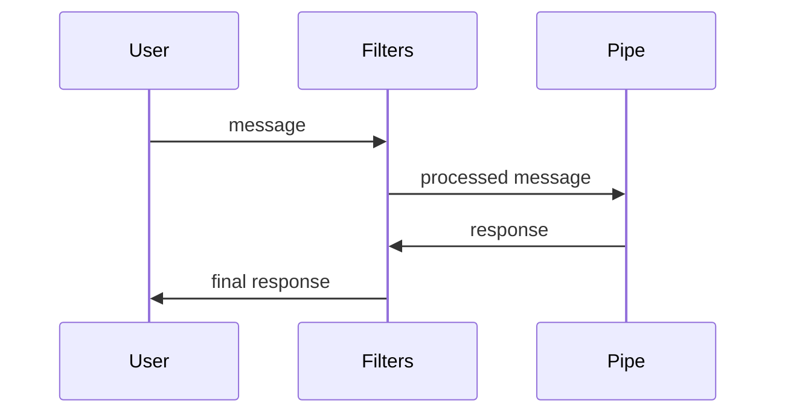

# Pipeline Explained

Open WebUI processes chat requests through a pipeline of filters and a pipe. A
simplified flow looks like:

Filters can transform both the input and output. The pipe generates the main
response and may call tools. Place extension modules in `functions/` so that Web
UI can load them into this pipeline.
