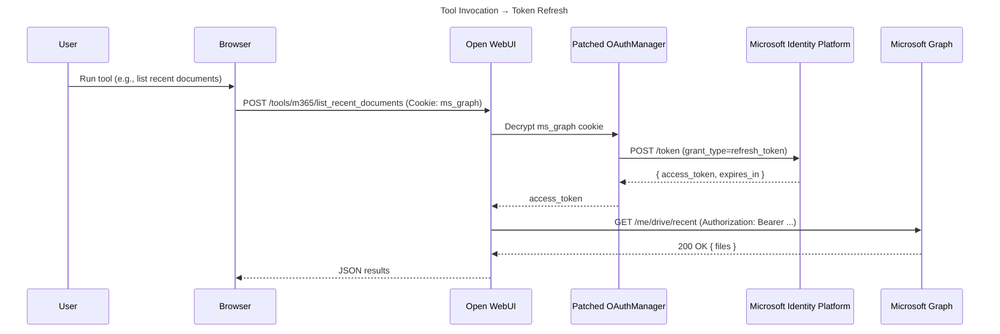
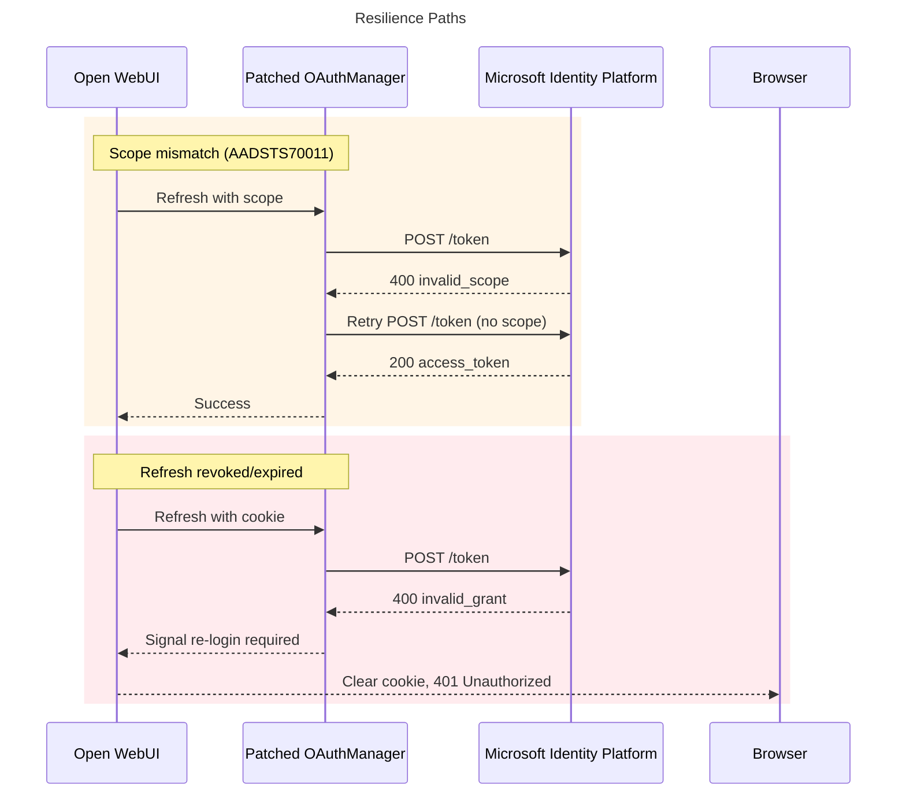

# Microsoft 365 Tool

## Overview

This tool demonstrates how to call the Microsoft Graph API directly from Open WebUI using the user’s existing SSO session. Instead of forcing an extra login, it securely captures the refresh token issued by Open WebUI’s Azure SSO flow and stores it in an encrypted, HTTP-only cookie. That refresh token is then exchanged for access tokens on demand, so the tool can act on behalf of the signed-in user without any additional authentication steps.

## Prerequisites

* **Open WebUI** configured with Microsoft/Azure AD single sign-on.
* **Azure App Registration** with delegated permissions and admin consent for:

  * `offline_access` (refresh token)
  * `Files.Read` (add more scopes as needed)
* Client secret created and stored securely.
* The following environment variables must be set in Open WebUI:

```bash
MICROSOFT_CLIENT_TENANT_ID=<your-tenant-guid>
MICROSOFT_CLIENT_ID=<your-client-id>
MICROSOFT_CLIENT_SECRET=<your-client-secret>
MICROSOFT_OAUTH_SCOPE="openid email profile offline_access Mail.Read Files.Read Sites.Read.All Chat.Read Calendars.Read Contacts.Read"
WEBUI_SECRET_KEY=<super-shared-secret>
```

---

## How the OAuth Monkey Patch Works

By default, **Open WebUI’s only exposes an `oauth_id_token`** to downstream tools. That token is meant for identity assertions (proving 'who the user is'), not for long-lived API access. In particular:

* Microsoft Graph requires an **OAuth 2.0 access token** (`Bearer` token) to authorize API calls.
* Access tokens issued by Microsoft are **short-lived** (\~1 hour).
* Without a refresh mechanism, any tool calling Graph will break as soon as the token expires.

To fix this, we introduce a **monkey patch** to `open_webui.utils.oauth.OAuthManager` so that Open WebUI captures and persists a usable refresh token for each user.

---

### 1. Capture the Full Token Response

* During the Azure AD OAuth callback, the Microsoft identity platform returns a JSON payload with `id_token`, `access_token`, `refresh_token`, and `scope`.
* Normally Open WebUI discards everything except `id_token`.
* The patch intercepts this step and **retains the `refresh_token` and scope string**.

Why this matters:

* The refresh token is the only artifact that can be traded for new access tokens after the original expires.
* By holding onto it, we can make the tool work seamlessly without re-authenticating the user.

```mermaid
sequenceDiagram
    title OAuth Callback → Secure Cookie
    participant U as User
    participant B as Browser
    participant W as Open WebUI
    participant M as Patched OAuthManager
    participant A as Microsoft Identity Platform

    U->>B: Click "Sign in with Microsoft"
    B->>A: OAuth authorize (Open WebUI client)
    A-->>B: Redirect with auth code
    B->>W: GET /oauth/callback?code=...
    W->>M: Handle token exchange
    M->>A: POST /token (authorization_code)
    A-->>M: { id_token, access_token, refresh_token, scope }
    M->>M: Encrypt refresh_token + scope with Fernet(WEBUI_SECRET_KEY)
    M-->>B: Set-Cookie ms_graph=<encrypted>; HttpOnly; Secure
    W-->>B: Finalize login
```

---

### 2. Secure Persistence in a Cookie

* Instead of storing tokens in Redis or a database (which would break stateless scaling), the patch **encrypts** the refresh token and granted scopes using **Fernet**.
* The Fernet key is derived from the global `WEBUI_SECRET_KEY` so all replicas share the same encryption context.
* The encrypted blob is written into an **HTTP-only cookie** (default name: `ms_graph`).

Benefits:

* **Stateless across replicas** → works behind load balancers.
* **Client-side persistence** → no token vault required.
* **Secure by design** → only Open WebUI can decrypt the cookie contents.

---

### 3. Redeem on Demand

* When a tool executes (e.g., `list_recent_documents`), it looks for the `ms_graph` cookie.
* The cookie is decrypted, yielding the refresh token and scopes.
* The refresh token is sent to Azure AD’s `/token` endpoint with the **refresh\_token grant** to get a fresh access token.
* If the request fails with `AADSTS70011` (scope mismatch), the patch retries without explicitly passing scopes.



---

### 4. Resilience & Failure Modes

* **Scope mismatch** → Retry without scope parameter.
* **Refresh token revoked/expired** → Return `401` and prompt user to sign in again.



---

### 5. Why a Monkey Patch?

* Open WebUI wasn’t originally designed to persist refresh tokens.
* Rather than forking the project, the patch extends `OAuthManager` behavior at runtime.
* This keeps the patch self-contained, minimal, and reusable in any tool that needs Microsoft Graph integration.

---

## Changelog

See [CHANGELOG.md](CHANGELOG.md) for version history.